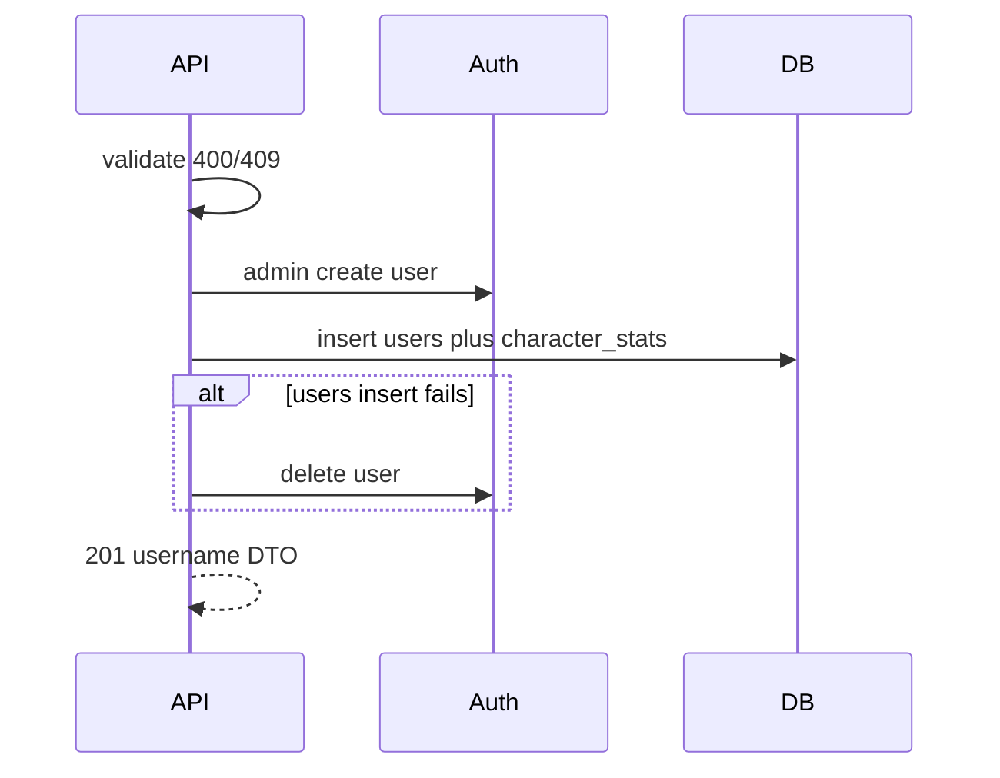

# B2 — signup, no photo

Slice 2 of 3. Depends on [B1](signup_b1_model_security.plan.md). Next: [B3 photo](signup_b3_photo.plan.md). Spec: [ai/implement-signup-spec.md](../../ai/implement-signup-spec.md).

Picked **B**: three review stops. Frontend / JWT / `GET /api/me` are **out**.

The ticket, minus Storage. One POST creates Auth + profile + character. Password never touches `public.users`.

## Spec (this slice)

- `POST /api/auth/signup`
- Validate; 400 bad input/password; 409 duplicate email/username
- Admin create Auth user; do not wait for email verify; password only in `auth.users`
- Insert `public.users`: username, email, `user_icon` if any, `inner_id` = Auth uuid. If this insert fails, delete that Auth user
- 201 profile DTO = `{ username }` only. TODO in code to expand when frontend exists
- `playerName` = username
- Skip JWT, `/api/me`, frontend
- Photo / Storage is **B3** — skip here; `profile_url` stays null

## Noise — keep unless you say otherwise

- RestClient, no Supabase Java SDK. No generated tests (development-plan)
- 400 also for unknown class
- Class default emojis ⚔️ / 🏹 / 🪄
- English class names + [backend/ARCHITECTURE.md](../../backend/ARCHITECTURE.md) layering
- Class is on `character_stats` (`knight|archer|magician`), so signup inserts that row
- Guerrero/Arquero/Mago → knight/archer/magician
- Permit-all already from B1



## Lands

- `AuthController` `POST /api/auth/signup`. Params: `username`, `email`, `password` (required); `playerClass`, `userIcon` (optional). No `photo` yet.
- `SignupService`:
  1. Validate: email shape, password min 6, known class or default Guerrero. Fail → 400.
  2. Duplicate username/email in our table → 409.
  3. `SupabaseAuthService`: Admin `POST /auth/v1/admin/users` with `email_confirm: true`. Returns Auth uuid.
  4. Transaction: `UserService` insert (`inner_id` = uuid, `user_icon` or class default) then `CharacterStatsService` insert (`class` mapped, `playerName` = username) then set `users.playerName` / `player_id`.
  5. If step 4 fails: `DELETE /auth/v1/admin/users/{id}`, then 400/409/500 as appropriate. Password is not in our DB either way.
  6. 201 `{ "username": "..." }` only.
- `SupabaseAuthService` + `SupabaseProperties` + `RestClient` with service-role key. No SDK.
- `GlobalExceptionHandler`: `{ "error": "..." }` for 400/409.

## Does not land

Photo param, Storage, `profile_url` writes (stays null).

## You read

`SignupService`, `AuthController`, `SupabaseAuthService`.

## Test

POST `http://localhost:8080/api/auth/signup` (no photo). Supabase: Auth user exists, `public.users` has matching `inner_id` and no password, `character_stats` has `playerName` = username. Same email/username again → 409. Password `123` → 400. Body is only `{ "username": "..." }`. **Do not generate tests.**

```powershell
$stamp = Get-Date -Format "yyyyMMddHHmmss"
$username = "test-can-delete-later-$stamp"
$email = "test-can-delete-later-$stamp@lifequest.test"
$password = "secret1"

# 201 — body only {"username":"..."}
curl.exe -s -w "`nHTTP:%{http_code}" -X POST "http://localhost:8080/api/auth/signup" `
  -H "Content-Type: application/x-www-form-urlencoded" `
  --data-urlencode "username=$username" `
  --data-urlencode "email=$email" `
  --data-urlencode "password=$password" `
  --data-urlencode "playerClass=Guerrero"

# 409 — same email/username again
curl.exe -s -w "`nHTTP:%{http_code}" -X POST "http://localhost:8080/api/auth/signup" `
  -H "Content-Type: application/x-www-form-urlencoded" `
  --data-urlencode "username=$username" `
  --data-urlencode "email=$email" `
  --data-urlencode "password=$password"

# 400 — password 123
curl.exe -s -w "`nHTTP:%{http_code}" -X POST "http://localhost:8080/api/auth/signup" `
  -H "Content-Type: application/x-www-form-urlencoded" `
  --data-urlencode "username=test-can-delete-later-short-$stamp" `
  --data-urlencode "email=test-can-delete-later-short-$stamp@lifequest.test" `
  --data-urlencode "password=123"
```
